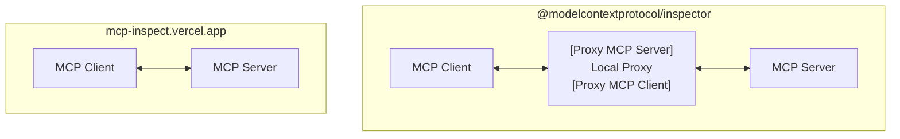

# MCP Remote Inspector

A minimal, browser-based tool for inspecting **real, raw message exchanges** between an MCP Client and a _remote MCP Server_. Unlike the official [`@modelcontextprotocol/inspector`](https://github.com/modelcontextprotocol/inspector), this project is **client-only**—no local proxy server required. You can use it instantly _[👉 HERE](https://mcp-inspect.vercel.app/)_.



<!-- | This Project                                            | @modelcontextprotocol/inspector                             |
| ------------------------------------------------------- | ----------------------------------------------------------- |
|  |  | -->

### [https://mcp-inspect.vercel.app](https://mcp-inspect.vercel.app/)


### @modelcontextprotocol/inspector


<!--  -->

---

## Key Features & Differences

- **Direct-to-Server:** Connects directly to any MCP Server endpoint (SSE or Streamable HTTP), so you see the _real_ messages and endpoints—no proxy masking.
- **Raw Endpoint Visibility:** If the server sends a message to `/mcp/message`, you'll see `/mcp/message` (not `/message` as with the official inspector's proxy).
- **Heartbeat/Ping Support:** All messages, including server heartbeats (ping), are visible. The official inspector hides these.
- **Streamable HTTP Mode:** If the server uses `enableJsonResponse=true`, you'll see the actual JSON response. The official inspector always shows `text/event-stream` (from its proxy), not the real server response.

## Limitations

- **Tools-Only Focus:** Only supports the _Tools_ use case (SSE and Streamable HTTP). Does **not** support STDIO, Prompts, Resources, etc.
- **CORS:** As a browser app, it is subject to CORS restrictions. If the MCP Server does not allow cross-origin requests, you may not be able to connect. Unlike the official inspector, there is no local proxy to bypass CORS.

## When to Use This

- You want to see the _real_ message flow between your MCP Client and a remote MCP Server.
- You want to debug or understand the actual protocol, endpoints, and message types (including heartbeats/pings).
- You don't want to install or run @modelcontextprotocol/inspector, just access an MCP Inspector directly.

## How to Use

### 1. Use the Live Demo

Just open [https://mcp-inspect.vercel.app](https://mcp-inspect.vercel.app/) in your browser.

- Enter your MCP Server URL (examples: `https://mcp.deepwiki.com/sse` for SSE, `https://mcp.context7.com/mcp` for Streamable HTTP).
- Choose the transport type (SSE or Streamable HTTP).
- Connect, list tools, select a tool, fill in parameters, and call the tool.
- View and copy the raw results and all exchanged messages.
- **Tip:** Open your browser's DevTools Network tab to see the real HTTP requests and responses exchanged directly with the MCP server—no proxy, no masking.


### 2. Run Locally (for development)

```bash
npm install
npm run dev
```

Then open [http://localhost:5173](http://localhost:5173) in your browser.

### 3. Build for Production

```bash
npm run build
```

---

## Why Not Use the Official Inspector?

- The official [`modelcontextprotocol/inspector`](https://github.com/modelcontextprotocol/inspector) runs a local proxy server, so you only see messages as they pass through the proxy—not the _real_ server endpoints or all message types.
- This project is ideal for protocol debugging, CORS testing, and understanding the _actual_ MCP Client/Server exchange.

---

## License

MIT
